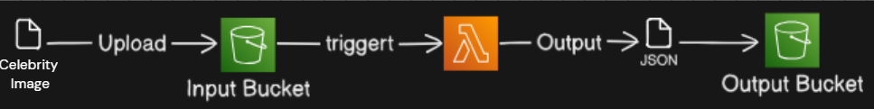
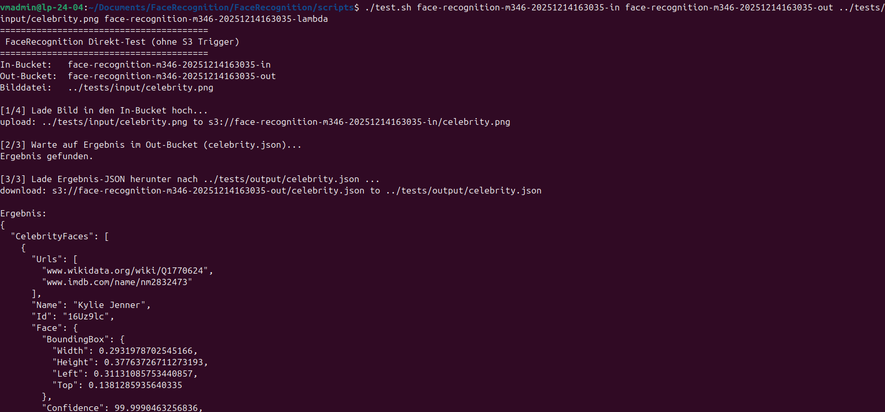
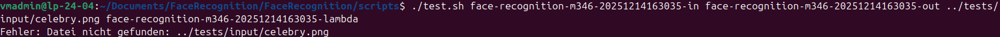
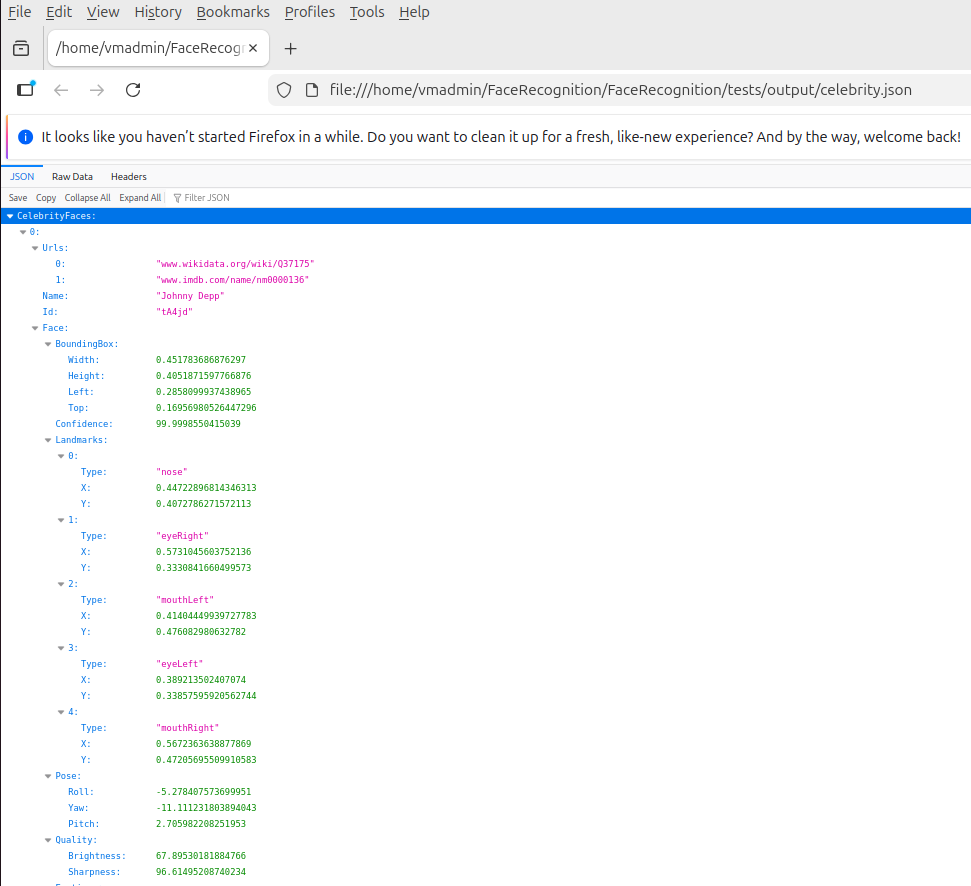

# FaceRecognition

- [FaceRecognition](#facerecognition)
  - [Projektbeschreibung](#projektbeschreibung)
  - [Aufbau des Services](#aufbau-des-services)
  - [Anforderungen](#anforderungen)
  - [Projektstruktur](#projektstruktur)
  - [Inbetriebnahme](#inbetriebnahme)
    - [Anpassen der Konfiguration](#anpassen-der-konfiguration)
  - [Nutzung](#nutzung)
    - [Datei hochladen](#datei-hochladen)
  - [Infrastruktur löschen](#infrastruktur-löschen)
  - [Test-Protokoll](#test-protokoll)
    - [Durchgeführte Tests](#durchgeführte-tests)
      - [1. End-to-End-Test mit gültigem Bild einer bekannten Persönlichkeit](#1-end-to-end-test-mit-gültigem-bild-einer-bekannten-persönlichkeit)
      - [2. Mehrfachausführung des Test-Skripts](#2-mehrfachausführung-des-test-skripts)
      - [3. Test mit ungültigem Bildpfad](#3-test-mit-ungültigem-bildpfad)
      - [5. Überprüfung des JSON-Inhalts](#5-überprüfung-des-json-inhalts)
    - [Zusammenfassung der Testergebnisse](#zusammenfassung-der-testergebnisse)
    - [Gesamtes Fazit](#gesamtes-fazit)
  - [Projekt-Team](#projekt-team)
  - [Aufgabenverteilung](#aufgabenverteilung)
  - [Reflexion](#reflexion)
    - [Sandro Meier](#sandro-meier)
    - [Alexis Karapsias Fernandez](#alexis-karapsias-fernandez)
    - [Yven Zuercher](#yven-zuercher)
  - [Quellenverzeichnis](#quellenverzeichnis)

---

## Projektbeschreibung

Im Rahmen des Moduls **346 – Cloudlösungen konzipieren und realisieren** wurde ein Cloud-Service entwickelt, welcher bekannte Persönlichkeiten auf Bildern automatisch erkennt.

Der Service basiert auf **AWS Rekognition (RecognizeCelebrities)** und ist vollständig automatisiert aufgebaut. Nach dem Upload eines Bildes in einen S3-Bucket wird die Analyse selbstständig durchgeführt und das Ergebnis als JSON-Datei gespeichert.

**Ablauf des Services:**

1. Ein Bild wird in einen definierten **S3 In-Bucket** hochgeladen
2. Ein **S3-Event** löst eine **AWS Lambda-Funktion** aus
3. Die Lambda-Funktion analysiert das Bild mit AWS Rekognition
4. Die Analyseergebnisse werden als **JSON-Datei** in einem **S3 Out-Bucket** gespeichert
5. Ein Test-Skript kann die Ergebnisse herunterladen und anzeigen

Der gesamte Service kann über CLI-Skripte installiert, getestet und wieder entfernt werden.

---

## Aufbau des Services

Der FaceRecognition-Service besteht aus folgenden Komponenten:

* **S3 In-Bucket**
  Dieser Bucket dient als Eingang für Bilddateien.
  Jeder Upload löst automatisch ein `ObjectCreated`-Event aus.

* **AWS Lambda-Funktion (Python)**

  * Wird durch den Upload eines Bildes getriggert
  * Ruft `RecognizeCelebrities` von AWS Rekognition auf
  * Erstellt eine strukturierte JSON-Ausgabe
  * Speichert das Resultat im Out-Bucket

* **S3 Out-Bucket**
  Enthält die automatisch generierten JSON-Dateien mit den Analyseergebnissen.

* **IAM-Rolle (LabRole)**
  Ermöglicht der Lambda-Funktion:

  * Zugriff auf AWS Rekognition
  * Lesen aus dem In-Bucket
  * Schreiben in den Out-Bucket
  * Schreiben von Logs nach CloudWatch



---

## Anforderungen

* Aktives **AWS Learner Lab**
* Installierte **AWS CLI v2**
* Konfigurierte AWS Credentials
* Bash-kompatible Shell (Linux, macOS, WSL oder Git Bash)
* ZIP-Tool für das Packaging der Lambda-Funktion
* Optional: **Python 3** zur Anzeige der JSON-Ergebnisse im Test-Skript

---

## Projektstruktur

```text
lambda/
  lambda_function.py      # Lambda-Code für Gesichtserkennung

scripts/
  init.sh                 # Erstellt die gesamte AWS-Infrastruktur
  test.sh                 # Führt einen End-to-End-Test aus

tests/
  input/                  # Testbilder
  output/                 # heruntergeladene JSON-Dateien
  screenshots/            # Screenshots der Tests

docs/
  architektur-diagramm.png

README.md
```

---

## Inbetriebnahme

1. Repository klonen:

   ```bash
   git clone https://github.com/SMeierS25/FaceRecognition
   cd FaceRecognition
   ```

2. Skripte ausführbar machen:

   ```bash
   chmod +x scripts/init.sh scripts/test.sh
   ```

3. Infrastruktur erstellen:

   ```bash
   cd scripts
   ./init.sh
   ```

Das Initialisierungs-Skript erstellt automatisch:

* zwei S3-Buckets (In & Out)
* eine Lambda-Funktion
* den S3-Trigger für den In-Bucket

Die Namen der erstellten Komponenten werden im Terminal ausgegeben.

---

### Anpassen der Konfiguration

Im Skript `init.sh` kann der Projektpräfix angepasst werden:

```bash
PROJECT_PREFIX="face-recognition-m346"
```

Die restlichen Namen werden automatisch generiert (inkl. Timestamp), wodurch Namenskollisionen vermieden werden.

---

## Nutzung

### Datei hochladen

Der empfohlene Weg ist das Test-Skript:

```bash
./test.sh <IN_BUCKET> <OUT_BUCKET> <BILDDATEI> <LAMBDA_NAME>
```

Beispiel:

```bash
./test.sh face-recognition-123-in \
          face-recognition-123-out \
          ../tests/input/testbild.jpg \
          face-recognition-123-lambda
```

**Ablauf:**

* Bild wird hochgeladen
* Script wartet auf das Analyse-Ergebnis
* JSON-Datei wird heruntergeladen
* Erkannte Personen und Wahrscheinlichkeiten werden ausgegeben

---

## Infrastruktur löschen

Da kein eigenes Terminate-Skript vorhanden ist, erfolgt das Löschen manuell:

```bash
aws lambda delete-function --function-name "<LAMBDA_NAME>"

aws s3 rm s3://<IN_BUCKET> --recursive
aws s3 rm s3://<OUT_BUCKET> --recursive

aws s3 rb s3://<IN_BUCKET>
aws s3 rb s3://<OUT_BUCKET>
```

--- 

## Test-Protokoll

Die Tests wurden durchgeführt, um sicherzustellen, dass der FaceRecognition-Service korrekt funktioniert, stabil ist und die Anforderungen aus dem Projekt erfüllt.
Alle Tests wurden im **AWS Learner Lab** durchgeführt.

**Testdatum:** 11.12.2025  
**Tests durchgeführt von:**
Sandro Meier 

---

### Durchgeführte Tests

#### 1. End-to-End-Test mit gültigem Bild einer bekannten Persönlichkeit


**Beschreibung:**
Es wird ein Bild einer bekannten Persönlichkeit in den In-Bucket hochgeladen. Anschliessend wird überprüft, ob die Lambda-Funktion korrekt ausgelöst wird und eine JSON-Datei mit den Analyseergebnissen im Out-Bucket erstellt wird.

**Vorgehen:**

1. Ausführen des Test-Skripts `test.sh`
2. Upload eines gültigen Bildes aus `tests/input/`
3. Warten auf die automatische Verarbeitung
4. Download der erzeugten JSON-Datei
5. Überprüfung des Inhalts

**Erwartetes Ergebnis:**

* Die Lambda-Funktion wird ausgelöst
* Im Out-Bucket erscheint eine JSON-Datei mit gleichem Namen wie das Bild
* Der erkannte Name der Persönlichkeit wird zusammen mit einer Wahrscheinlichkeit ausgegeben

**Resultat:**
Test erfolgreich  
Die erkannte Persönlichkeit und die angegebene Wahrscheinlichkeit stimmen mit dem erwarteten Resultat überein.

**Fazit:**
Der grundlegende Funktionsablauf (Upload → Analyse → Speicherung) funktioniert korrekt.

---

#### 2. Mehrfachausführung des Test-Skripts 



**Beschreibung:**
Dieser Test überprüft, ob das Test-Skript sowie die Infrastruktur auch bei mehrfacher Ausführung korrekt funktionieren und keine Fehler verursachen.

**Vorgehen:**

1. Mehrmaliges Ausführen von `test.sh` mit verschiedenen Bildern
2. Überprüfung, ob jeweils neue JSON-Dateien erstellt werden

**Erwartetes Ergebnis:**

* Keine Fehlermeldungen
* Für jedes Bild wird eine eigene JSON-Datei erzeugt
* Vorhandene Dateien werden nicht überschrieben

**Resultat:**
Test erfolgreich

**Fazit:**
Die Infrastruktur ist stabil und mehrfach nutzbar. Das System verhält sich robust bei wiederholten Tests.

---

#### 3. Test mit ungültigem Bildpfad



**Beschreibung:**
Es wird überprüft, wie sich das Test-Skript verhält, wenn ein nicht existierender Bildpfad übergeben wird.

**Vorgehen:**

1. Ausführen von `test.sh` mit einem falschen Dateipfad

**Erwartetes Ergebnis:**

* Das Skript bricht ab
* Eine verständliche Fehlermeldung wird ausgegeben
* Es erfolgt kein Upload in den In-Bucket

**Resultat:**
Test erfolgreich

**Fazit:**
Das Test-Skript verfügt über eine sinnvolle Fehlerbehandlung und verhindert falsche Uploads.

---

#### 5. Überprüfung des JSON-Inhalts



**Beschreibung:**
Der Inhalt der generierten JSON-Datei wird überprüft, um sicherzustellen, dass die Analyseergebnisse vollständig und korrekt gespeichert werden.

**Überprüfte Punkte:**

* Name der erkannten Persönlichkeit
* Wahrscheinlichkeit der Erkennung
* Struktur und Vollständigkeit der JSON-Datei

**Resultat:**
JSON korrekt

**Fazit:**
Die JSON-Ausgabe ist sauber strukturiert, gut lesbar und enthält alle relevanten Informationen der Rekognition-Analyse.

---

### Zusammenfassung der Testergebnisse

| Testfall                          | Ergebnis    |
| --------------------------------- | ----------- |
| End-to-End-Test mit gültigem Bild | Erfolgreich |
| Mehrfachausführung der Tests      | Erfolgreich |
| Ungültiger Bildpfad               | Erfolgreich |
 Validierung der JSON-Datei        | Erfolgreich |

---

### Gesamtes Fazit

Alle durchgeführten Tests verliefen erfolgreich.
Der FaceRecognition-Service arbeitet stabil, erfüllt die funktionalen Anforderungen und kann zuverlässig automatisiert installiert, getestet und verwendet werden.

Es wurden keine kritischen Fehler festgestellt.
Für zukünftige Erweiterungen wäre ein zusätzliches Lösch-Skript (`terminate.sh`) sinnvoll, um auch den Abbau der Infrastruktur vollständig zu automatisieren.

---

## Projekt-Team

* Sandro Meier
* Alexis Karapsias Fernandez
* Yven Zuercher

---

## Aufgabenverteilung

| Aufgabe                                     | Person               | Zeitraum            |
| ------------------------------------------- | -------------------- | ------------------- |
| Planung der Service-Architektur             | Sandro, Alexis, Yven | 04.12.25 – 05.12.25 |
| Analyse Projektauftrag & Anforderungen      | Alexis               | 04.12.25 – 05.12.25 |
| Lambda-Funktion (Rekognition, JSON-Ausgabe) | Sandro               | 05.12.25 – 09.12.25 |
| Fehlerbehandlung & Logging in Lambda        | Yven               | 08.12.25 – 10.12.25 |
| Erstellung Infrastrukturskript (`init.sh`)  | Alexis               | 06.12.25 – 10.12.25 |
| S3-Trigger & IAM-Konfiguration              | Alexis               | 07.12.25 – 10.12.25 |
| Test-Skript (`test.sh`)                     | Yven                 | 09.12.25 – 11.12.25 |
| End-to-End-Tests & Screenshots              | Sandro                 | 15.12.25            |
| Dokumentation (README)                      | Alle                 | 11.12.25 – 15.12.25 |
| Reflexion                                   | Alle                 | 15.12.25            |

---

## Reflexion

### Sandro Meier

Ich habe in diesem Projekt vor allem viel über AWS Lambda und Rekognition gelernt. Besonders spannend war es, mit echten AWS-Services zu arbeiten und zu sehen, wie Events in der Cloud zusammenspielen. Rückblickend hätte ich mir teilweise klarere Anforderungen am Anfang gewünscht, da wir gewisse Details erst während der Umsetzung erkannt haben.

### Alexis Karapsias Fernandez

Die Automatisierung der Infrastruktur war für mich der wichtigste Lernpunkt. Das Schreiben eines Init-Skripts, das mehrfach ausgeführt werden kann, war anspruchsvoll, aber sehr lehrreich. Beim nächsten Projekt würde ich von Anfang an auch ein Lösch-Skript einplanen.

### Yven Zuercher

Ich habe gelernt, wie wichtig saubere Tests und eine gute Struktur sind. Besonders das Warten auf asynchrone Prozesse (S3 → Lambda → Output) war interessant. Für zukünftige Projekte würde ich die Parameter der Skripte noch klarer vereinheitlichen.

---

## Quellenverzeichnis


AWS:

- [AWS Dokumentation](https://docs.aws.amazon.com/)
- [AWS CLI Dokumentation](https://awscli.amazonaws.com/v2/documentation/api/latest/reference/index.html)
- [AWS CLI S3 mb Dokumentation](https://docs.aws.amazon.com/cli/latest/reference/s3/mb.html)
- [AWS CLI S3 rb Dokumentation](https://docs.aws.amazon.com/cli/latest/reference/s3/rb.html)
- [AWS CLI S3 rm Dokumentation](https://docs.aws.amazon.com/cli/latest/reference/s3/rm.html)
- [AWS CLI S3 cp Dokumentation](https://docs.aws.amazon.com/cli/latest/reference/s3/cp.html)
- [AWS CLI S3 ls Dokumentation](https://docs.aws.amazon.com/cli/latest/reference/s3/ls.html)
- [AWS CLI Lambda create-function Dokumentation](https://docs.aws.amazon.com/cli/latest/reference/lambda/create-function.html)
- [AWS CLI Lambda delete-function Dokumentation](https://docs.aws.amazon.com/cli/latest/reference/lambda/delete-function.html)
- [AWS CLI Lambda get-function Dokumentation](https://docs.aws.amazon.com/cli/latest/reference/lambda/get-function.html)
- [AWS CLI Lambda mit S3-Beispiel Dokumentation](https://docs.aws.amazon.com/lambda/latest/dg/with-s3-example.html)
- [AWS CLI IAM get-role Funktion Dokumentation](https://docs.aws.amazon.com/cli/latest/reference/iam/get-role.html)
- [AWS CLI s3api put-public-access-block Dokumentation](https://docs.aws.amazon.com/cli/latest/reference/s3api/put-public-access-block.html)
- [AWS CLI s3api put-bucket-ownership-controls Dokumentation](https://docs.aws.amazon.com/cli/latest/reference/s3api/put-bucket-ownership-controls.html)
- [AWS Amazon S3 Dokumentation](https://docs.aws.amazon.com/AmazonS3/latest/userguide/object-keys.html)
- [AWS Amazon Recognition RecognizeCelebrities API Documentation](https://docs.aws.amazon.com/rekognition/latest/APIReference/API_RecognizeCelebrities.html)
- [Boto3 (AWS SDK for Python) Documentation](https://docs.aws.amazon.com/pythonsdk/)

Microsoft:

- [Powershell Dokumentation](https://learn.microsoft.com/de-de/powershell/)

Linux:

- [Bash Dokumentation](https://www.gnu.org/software/bash/manual/bash.html)
- [Regex-Basics](https://ubuntu.com/blog/regex-basics)
- [Linux Ubuntu Forum Unterschied zwischen &> und 2>&1](https://askubuntu.com/questions/635065/what-is-the-differences-between-and-21)
- [Bash read-Befehl](https://linuxize.com/post/bash-read/)
- [Bash echo-Befehl](https://wiki.ubuntuusers.de/echo/)
- [Linux Command, um String n mal wiederholen](https://superuser.com/questions/86340/linux-command-to-repeat-a-string-n-times)
- [Bash Bedeutung von $](https://unix.stackexchange.com/questions/7704/what-is-the-meaning-of-in-a-shell-script)
- [Bash Skript bei Fehler automatisch abbrechen](https://stackoverflow.com/questions/2870992/automatic-exit-from-bash-shell-script-on-error)

